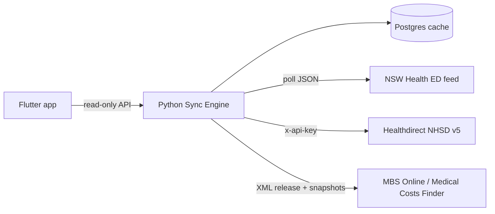

# System Overview (Hub)

A lean, **anonymous** Australian healthcare utility app. Three surfaces, all built on **public, aggregate data**:

1. Live **ED wait times** (NSW): [[NSW_Health_JSON_Engine]]
2. Verified **pharmacy hours and open/closed status**: [[Healthdirect_NHSD_API]]
3. **Typical specialist out-of-pocket costs** by MBS item and region: [[Medical_Costs_Finder]]

All three pipelines land in one local cache: [[Postgres_Cache_Schema]].

Every source is a government or government-adjacent surface, and the `.gov.au` badge does not tell you who owns the data. Before assuming a licence, check the entity: [[Australian_Gov_Surfaces]].

## Stack

- **Frontend:** Flutter. Stateless against the user: no accounts, no login, no profiles.
- **Sync engine:** Python (`requests`), one polite poller per source. Generic scaffold lives at `src/poller.py`.
- **Storage:** local PostgreSQL, cache of public data only. Schema and the forbidden-tables rule: [[Postgres_Cache_Schema]].
- **Serving rule:** users are **always served from cache**, never by proxying a live request to a source. This decouples user traffic from source load entirely.

## Privacy posture: out of scope by design (not "bypassed")

Wording matters here. The Privacy Act's health-information obligations attach to **collecting and holding personal information**. This system never collects or holds any, so the obligations never *arise*. That is data minimisation (APP 3 logic taken to its endpoint) and privacy by design. It is not a loophole, and describing it as "bypassing" the Act in any public doc would invite exactly the wrong reading.

Hard rules that make the posture real:

- **No personal data tables, permanently.** No users, accounts, sessions, device IDs, emails, DOBs, Medicare numbers. Enforced structurally in [[Postgres_Cache_Schema]] (forbidden-tables rule + schema lint).
- **No identifying telemetry.** No third-party analytics or ad SDKs. Crash reporting, if any, must be scrubbed of identifiers.
- **No server-side query logs pairing IP with a health query.** "Pharmacy near me at 2am" plus an IP address can itself become personal information. Location filtering happens **on device** against cached data; the backend never learns what a person searched.
- **Stateless API.** No cookies, no tokens, no per-user anything.

One honest caveat for future-us: if the product ever pivots to holding health information about people, the small-business exemption will not apply (health service providers are covered at any turnover) and the whole compliance picture reopens. That pivot is a **non-goal**, see below.

## Competitive landscape (checked 29/07/2026)

Nobody has built this exact thing. But **every individual surface already has an incumbent, and two of them are the official source publishing free to consumers.** That is the single most important strategic fact in this vault, so it lives in the hub rather than buried in a pipeline note.

| Surface | Incumbent | Coverage |
|---|---|---|
| ED wait times | **NSW Health itself** — `emergencywait.health.nsw.gov.au`. Patients waiting + treatment spaces, 15-minute refresh | **58 EDs** |
| | Doccy (`doccy.com.au`), NewDoc (`newdoc.com.au`), UpDoc (`updoc.com.au`) — all resell the NSW Health feed | 21 hospitals at best |
| Pharmacy hours | **Healthdirect's own free consumer app**, Service Finder, on both app stores | ~6,000 pharmacies nationally, plus 7,400 GP practices |
| Typical costs | **Medical Costs Finder itself** — government, free, web | National |

**Read the third parties correctly.** Doccy, NewDoc and UpDoc are telehealth companies. Their wait-time pages are SEO lead-generation funnelling to paid consults — $12.90 medical certificates, bulk-billed telehealth appointments. They are front doors, not utilities, and their ED coverage is a fraction of the official dashboard's. They are the opening, not the competition.

**No third party republishes MCF data.** That is not an open field — it is the copyright blocker in [[Medical_Costs_Finder]] working exactly as expected. Nobody else has permission either.

### What this means for the differentiator

**It cannot be the data.** All three feeds are public, and two are already packaged for consumers by the body that owns them. Three things survive:

1. **The combination.** Nothing puts ED wait times, pharmacy hours and typical costs in one place.
2. **Anonymity as the product, not a feature.** The telehealth incumbents are lead-generation — using them is the *opposite* of private. NSW Health's is a web page. On-device location filtering with no accounts and no server-side query logs, per the privacy posture above, is genuinely unusual in this space and is the one thing an incumbent structurally cannot copy: their business models need the identity.
3. **Cross-jurisdiction reach.** Every incumbent is single-state or single-domain. SA Health and Queensland Health both publish ED data (aggregate today — see [[Australian_Gov_Surfaces]]), so the ground exists.

### The pipeline 2 problem — open question, not a decision

Pharmacy is the weakest surface and it is currently sequenced as if it were the strongest. As it stands, [[Healthdirect_NHSD_API]] asks us to: wait a ~3-month onboarding, execute a legal agreement, pass a conformance gate — and then use Healthdirect's own API to rebuild a national pharmacy finder **that Healthdirect already gives away for free**.

That is the longest lead time, the heaviest legal overhead, and the strongest incumbent, all on the least defensible surface. Pipelines 1 and 3 are where the differentiation actually lives.

**This is an argument for resequencing, not for dropping it** — the combination in point 1 needs all three, and the NHSD clock only starts when the request is submitted, so starting it early and building elsewhere meanwhile is coherent. But it should be a decision made deliberately rather than by default. Flagged for Jared; not actioned.

## Non-goals (permanent for v1, deliberate)

- My Health Record integration (requires ADHA-conformant registered software)
- PRODA / Medicare claiming (requires Services Australia vendor registration)
- eRx / e-prescribing (conformance regime)
- Bookings, accounts, reminders, anything that names a human

## Execution status (11/06/2026)

| Phase | Note | Status |
|---|---|---|
| 1. Knowledge base | This vault | Generated |
| 2. ED ingestion | [[NSW_Health_JSON_Engine]] | Backend API + facilities feed confirmed; wait-count route pending (browser leg) |
| 3. Pharmacy data | [[Healthdirect_NHSD_API]] | Awaiting API registration. **Sequencing under question** — see the pipeline 2 problem above |
| 4. Costs data | [[Medical_Costs_Finder]] | MBS parser built, structure verified live; MCF ingestion TBC |
| 5. Cache | [[Postgres_Cache_Schema]] | Compose, init SQL and facilities ETL built; runbook: [[Local_Deployment]] |
